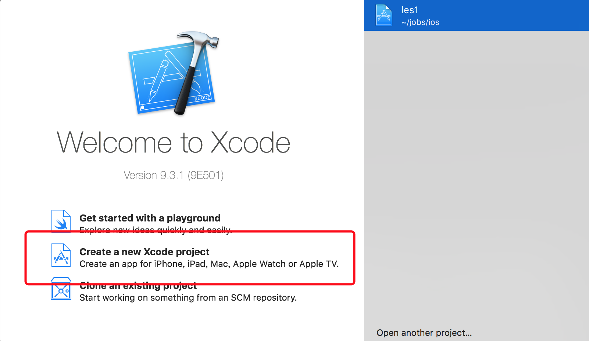
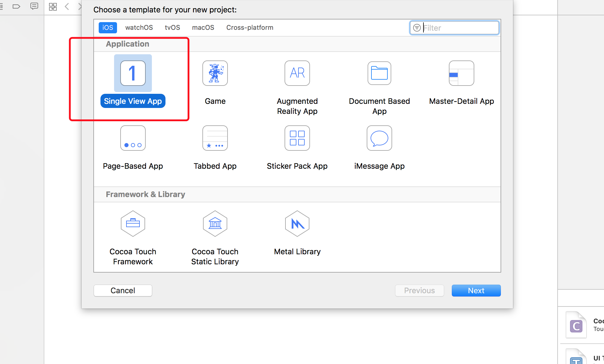
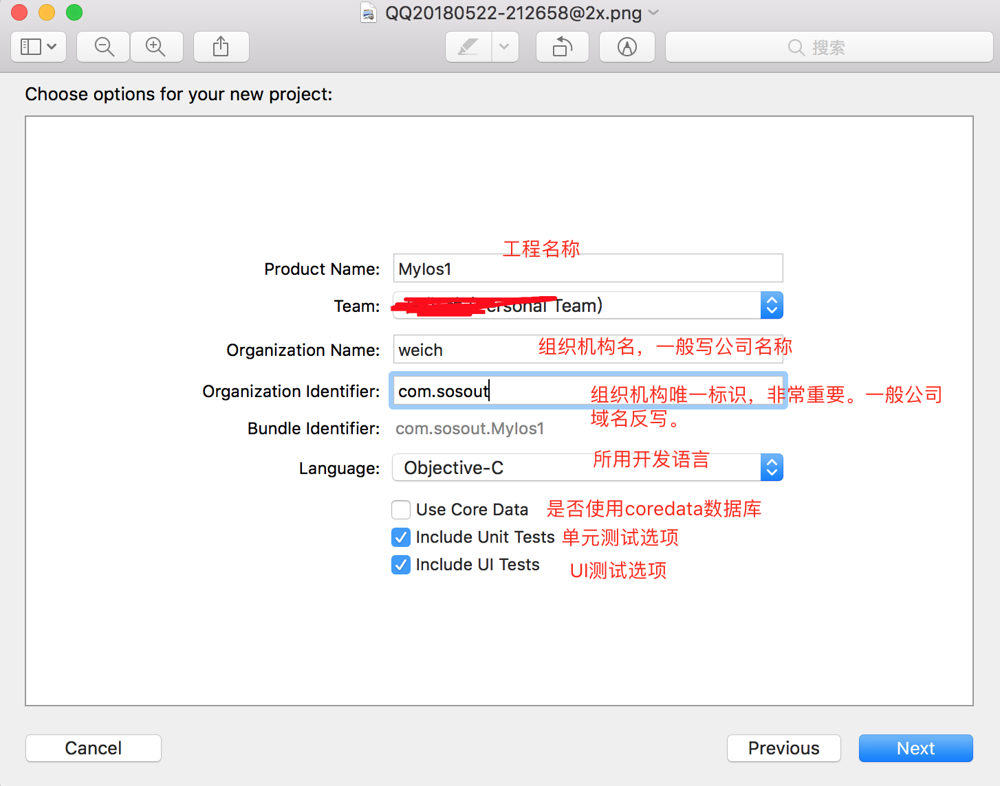
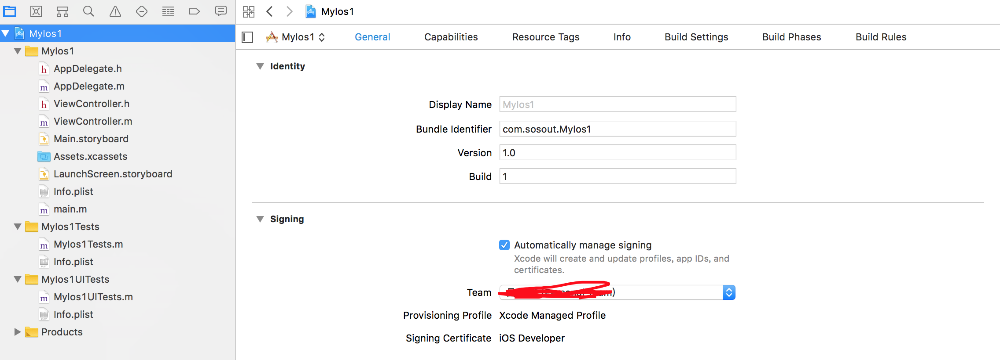

## 创建iOS工程

1、打开Xcode，选择Creat a new Xcode project

2、选择iOS的application树，选择single View application，然后next

3、比较重要的一项是Organization identifier，不能随便写，该标识是app上架后唯一的一个标识。

4、选择本地存储路径，工程创建完成。Xcode自动生成的工程如下图所示

